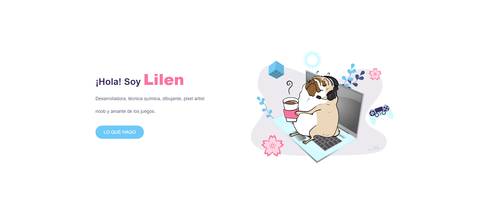

# :cherry_blossom: Mi portfolio :cherry_blossom:
#### Proyecto final del Módulo 1 - HTML y CSS de la carrera de Desarrollo Frontend en ADA ITW.

### :wrench: Estructura
* Header con nav principal
* 5 secciones
* Footer con links

### :black_nib: Contenido
* Portada
* Mis conocimientos
* Cita
* Mis proyectos
* Formulario de contacto

### ⚙️ Tecnologías

* HTML 5
* CSS 3

## Portada
En esta sección se puede ver una breve presentación de quién soy.

  

## Mis conocimientos
Sección donde se encuentran las principales tecnologías que utilizo en el desarrollo de mis proyectos.

  

## Cita

  

## Mis proyectos
En esta sección se muestran algunos de mis trabajos realizados a lo largo de mis estudios en ADA ITW.

  

## Formulario de contacto
Sección con un formulario para que puedas contactarte conmigo a través de la página y mis redes sociales.

  

 

### 
 Para visulizar la página hacer click en :rocket: github-pages. 

